# 📜 Campaign Timeline

A single-page timeline tool for D&D campaigns. Tracks events for multiple players across locations, using either the **Calendar of Harptos** (Faerûn) or the **Gregorian calendar**.

## Features

- **Multiple timelines** (profiles) — one per campaign or story arc
- **Two calendar systems** — Harptos (12 × 30-day months + 5 festival days) and Gregorian
- **Event duration** — set duration as `1d`, `3m`, `2y`; events render as bars on the graph
- **Per-player colour lanes** — each player gets their own horizontal lane within a column so events never overlap
- **Connection lines** — bezier curves link each player's events in chronological order
- **Segment-compressed Y axis** — empty centuries between event clusters collapse to a small gap bar
- **Today marker** — per-profile date marker with a full-width line dividing past from future
- **Show/hide players and locations** — for sharing your screen with players
- **Three themes** — Dark, Light, Slate (persisted)
- **Table view** — chronological table with CSV export
- **Search** — instant search across titles, descriptions, locations, and player names
- **Drag to move events** — drag any event circle to a new date or column
- **Location column reorder** — drag location names in the sidebar to reorder columns
- **Import / Export** — full JSON backup per profile

## Usage

Open `/timeline` in your browser after starting the server.

### Timeline Graph View (with demo data)
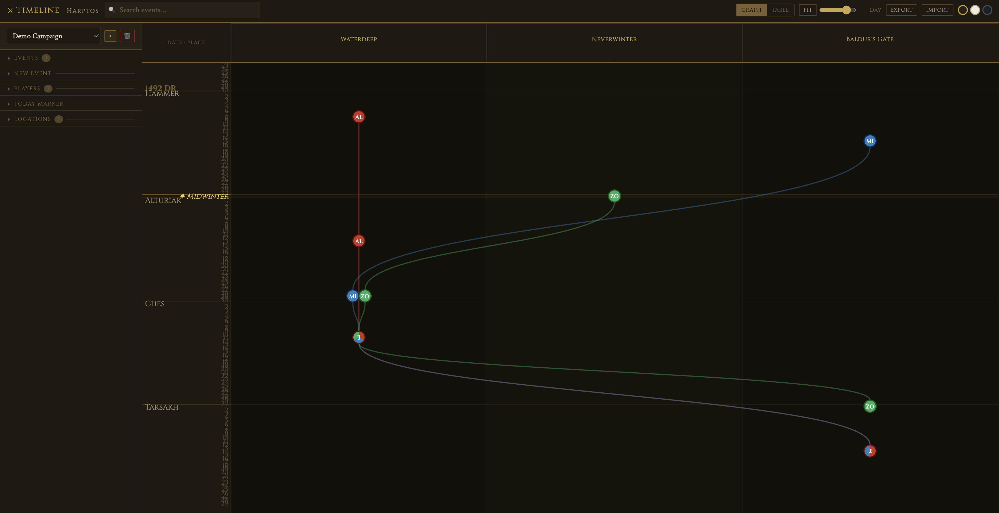
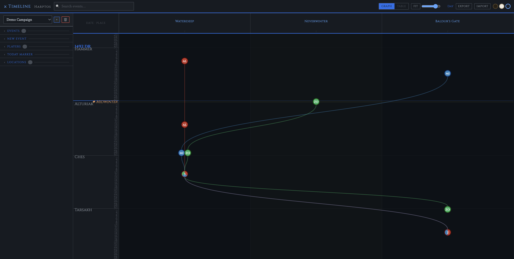
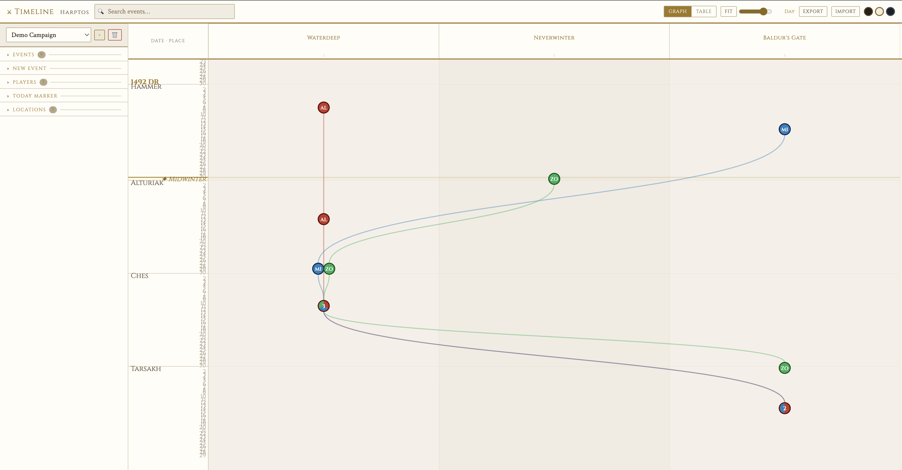

### Timeline Table View (with demo data)
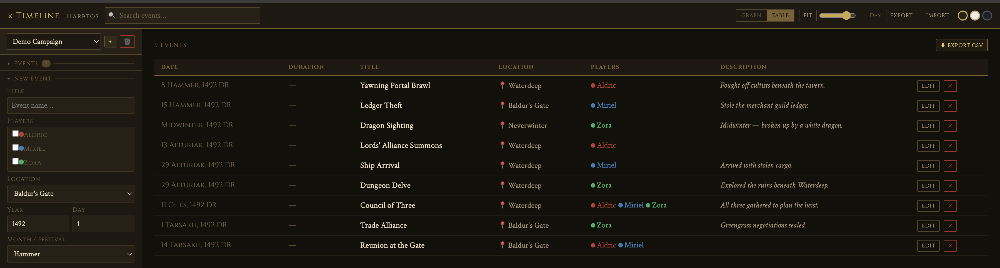

### Create a new Timeline
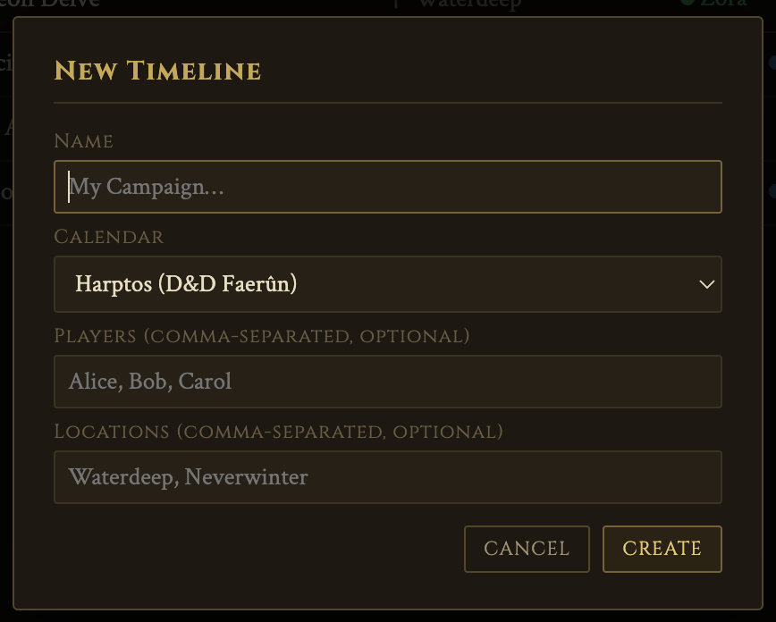

### Set a Today Marker
1. Open the **Today Marker** section in the sideber
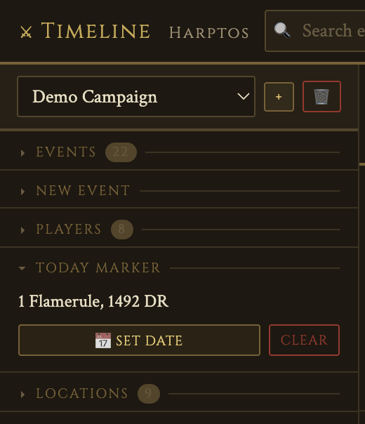
2. Set the new **Today Marker** (you can also "clear" the current marker)
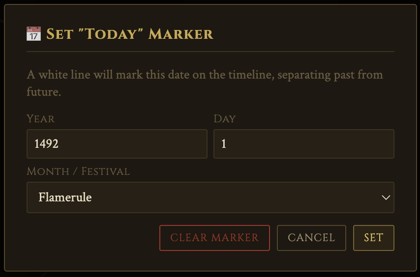

### Adding new Players and/or Locations

1. Open the **Players** or **Locations** section in the sidebar
2. Click **Add Player/Location**.
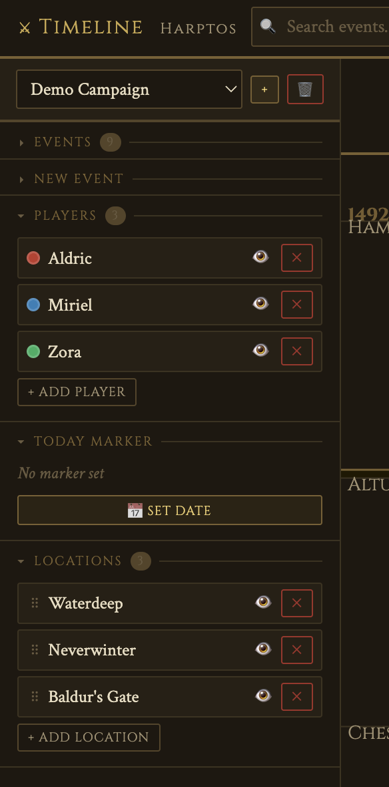
3. Set a Name for the **Location** and click on "Add"
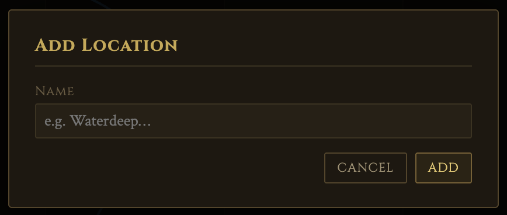
4. Set a Name and a Color for the **Player** and click on "Add"
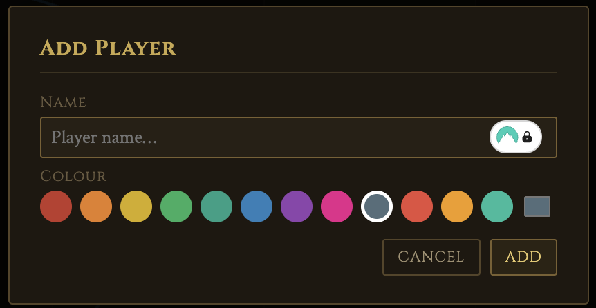

### Adding an event

1. Open the **New Event** section in the sidebar
2. Select one or more players
3. Choose a location, date, and optional duration
4. Click **Add Event** — the timeline scrolls to it and flashes it gold
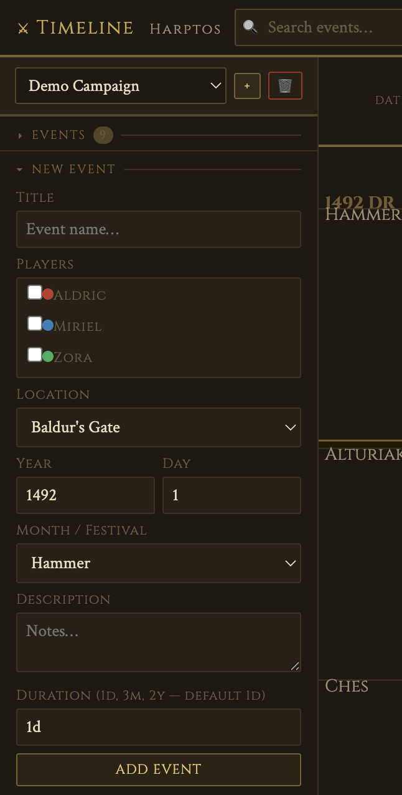

### Deleting an event

1. Navigate the timeline and look for your event (either look on the timeline or search for it)
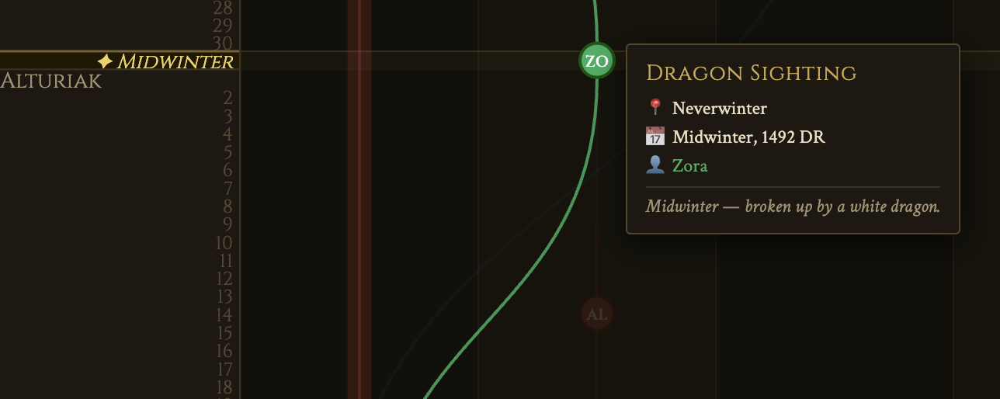
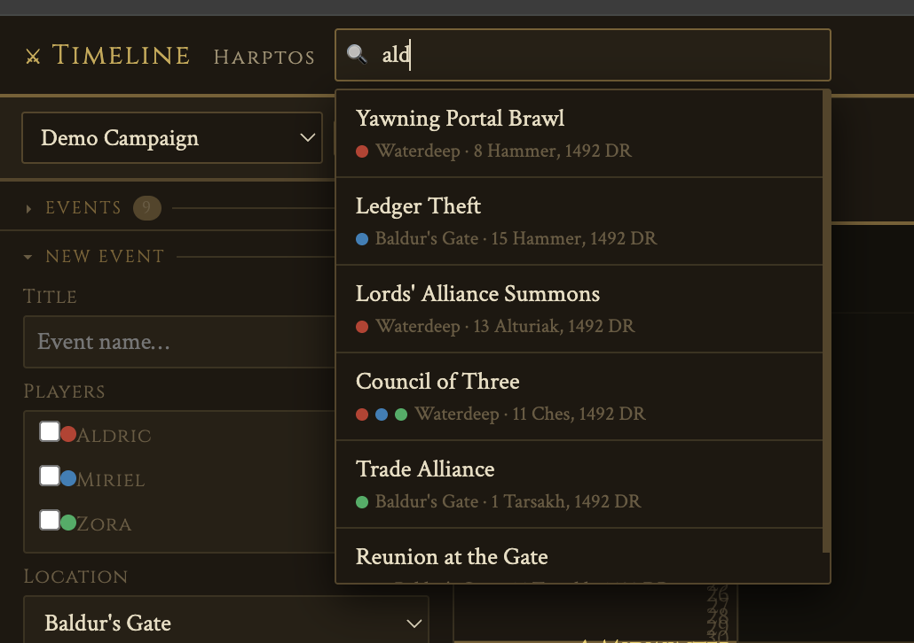
2. Click on the Event and open the "Event Card"
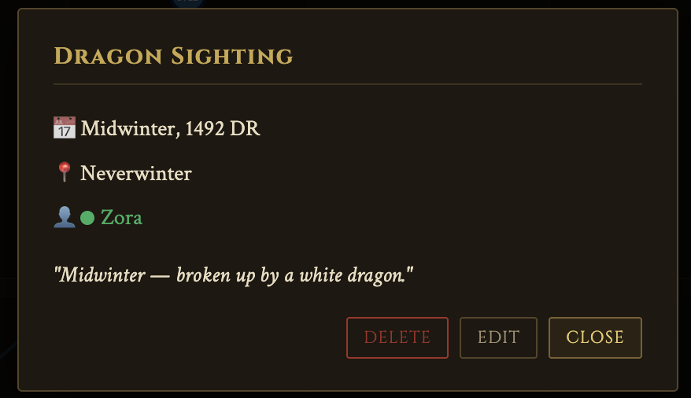
3. Click on "Delete"
4. You can also delete the events directly from the left sidebar menu
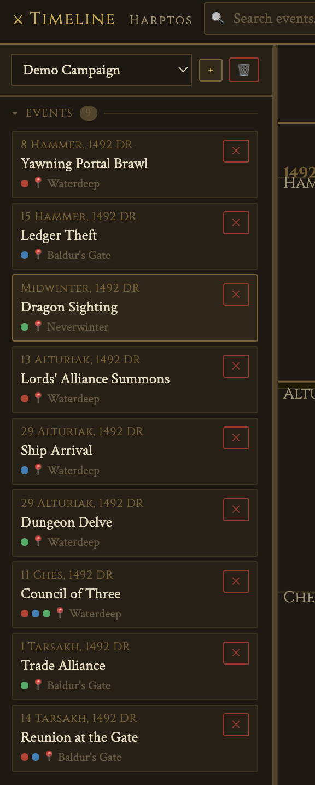

### Editing an event

1. Navigate the timeline and look for your event (either look on the timeline or search for it)

2. Click on the Event and open the "Event Card"

3. Click on "Edit"
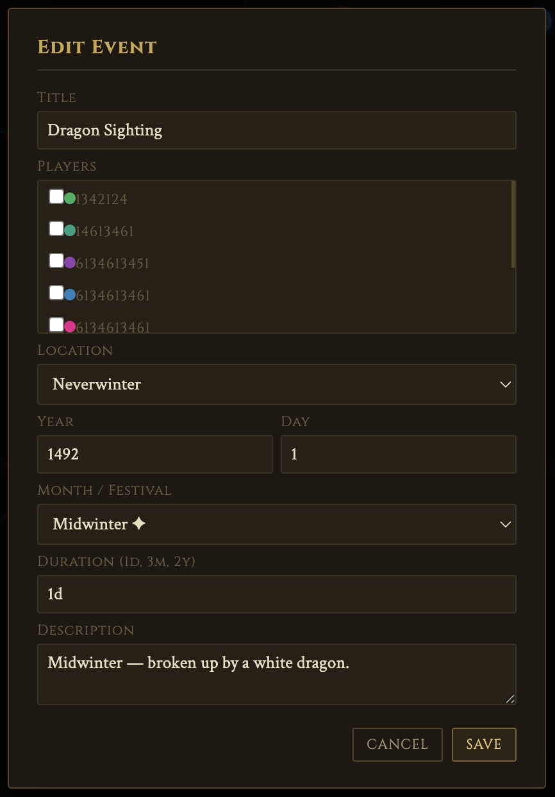
4. Save your changes

### Duration syntax

| Input | Meaning |
|---|---|
| `1d` (default) | 1 day |
| `14d` | 14 days |
| `3m` | ~3 months (90 days) |
| `2y` | ~2 years (730 days) |

### Setting "Today"

Open the **Today Marker** section in the sidebar and click **Set date**. A white/blue line will appear across the full timeline width at that date.

### Keyboard shortcuts (search box)

- `Enter` — jump to first result
- `Escape` — close search

## Data storage

All data is saved in the browser's `localStorage`. Use **Export** to download a JSON backup and **Import** to restore it. Data is per-browser — it does not sync across devices automatically.
